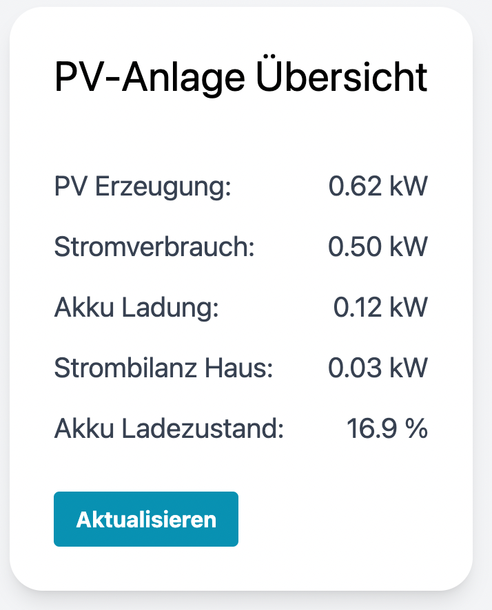

# Fronius Smartmeter + Wechselrichter UI

Dies ist ist eine einfache Übersicht der momentanen Leistungen von PV-Anlage, Wechselrichter, Akku und Netzbezug sowie Akkuladestand, da die Fronius hauseigene Übersicht bei mir sehr träge und langsam ist (teilweise >20 Sekunden bis zur Anzeige der Echtzeitwerte).
Die Anzeige aktualisiert sich alle 3 Sekunden oder die Aktualisierung kann per Button forciert werden.

## Screenshot

## Installation

- `npm install` mit Node JS 14 oder höher ausführen
- `npm run dev` startet die Applikation auf localhost:3000
- `npm run build` erzeugt einen Build, der auch lokal gehostet werden kann

## Angabe der Wechselrichter-IP

- die Wechselrichter IP muss in der `vite.config.js` angepasst werden
